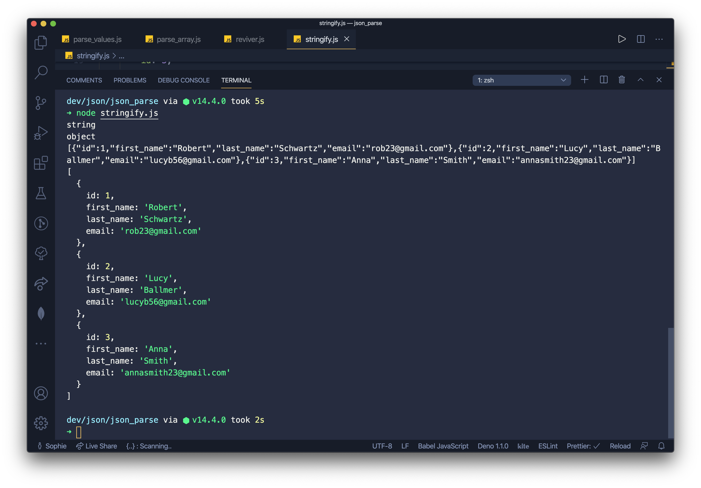

# JavaScript JSON.parse Tutorial

JavaScript JSON.parse tutorial shows how to parse JSON strings into JavaScript objects.

 
## JSON

**JSON (JavaScript Object Notation)** is a lightweight data-interchange format. It is easy for humans to read and write and for machines to parse and generate. The official Internet media type for JSON is `application/json`. The JSON filename extension is `.json`.

## JSON.parse

The `JSON.parse()` method parses a JSON string and creates a JavaScript value or object described by the string. An optional **reviver function** can be provided to perform a transformation on the resulting object before it is returned. The reverse operation is performed with `JSON.stringify()`.

## JSON.parse values

In the first example, we parse JSON strings into JavaScript values.

`parse_values.js`

```js
console.log(JSON.parse('-3'));
console.log(JSON.parse('12'));
console.log(JSON.parse('true'));
console.log(JSON.parse('"falcon"'));
```

The example parses and prints `integers`, a `boolean value` and a `string`.

`$ node parse_values.js`

`-3`  
  
`12` 
   
`true`  

`falcon`

This is the output.

## JSON.parse array

The next example parses a JSON array string into a JavaScript array.

`parse_array.js`

```js
let data = `[
  {
    "id": 1,
    "first_name": "Robert",
    "last_name": "Schwartz",
    "email": "rob23@gmail.com"
  },
  {
    "id": 2,
    "first_name": "Lucy",
    "last_name": "Ballmer",
    "email": "lucyb56@gmail.com"
  },
  {
    "id": 3,
    "first_name": "Anna",
    "last_name": "Smith",
    "email": "annasmith23@gmail.com"
  }
]`;

let users = JSON.parse(data);

console.log(typeof users)
console.log(users[1])
console.log(users);
```

We have a JSON string consisting of users. The string is parsed into a JavaScript array.

`let users = JSON.parse(data);`

The data is parsed.

`console.log(typeof users)`

We determine the data type of the returned data.

`console.log(users[1])`

We print the second user.

`console.log(users);`

We print the whole array.

`$ node parse_list.js`

```json
object
{
  id: 2,
  first_name: 'Lucy',
  last_name: 'Ballmer',
  email: 'lucyb56@gmail.com'
}
[
  {
    id: 1,
    first_name: 'Robert',
    last_name: 'Schwartz',
    email: 'rob23@gmail.com'
  },
  {
    id: 2,
    first_name: 'Lucy',
    last_name: 'Ballmer',
    email: 'lucyb56@gmail.com'
  },
  {
    id: 3,
    first_name: 'Anna',
    last_name: 'Smith',
    email: 'annasmith23@gmail.com'
  }
]
```

This is the output.

## JSON.parse reviver function

The `JSON.parse()` function can take an optional reviver function as the second parameter. It can perform a transformation on the resulting object before it is returned.

`reviver.js`

```js
let data = '{ "name": "John Doe", "dateOfBirth": "1976-12-01", "occupation": "gardener"}';

let user = JSON.parse(data, (k, v) => {

  if (k == "dateOfBirth") {
    return new Date(v);
  } else {
    return v;
  }
});

console.log(user);
```

In the example, we use the **reviver function** to transform a string property into a date.

## JSON.stringify

The `JSON.stringify()` function converts a JavaScript object or value to a JSON string.

`stringify.js`

```js
let users = [
    {
        id: 1,
        first_name: 'Robert',
        last_name: 'Schwartz',
        email: 'rob23@gmail.com'
    },
    {
        id: 2,
        first_name: 'Lucy',
        last_name: 'Ballmer',
        email: 'lucyb56@gmail.com'
    },
    {
        id: 3,
        first_name: 'Anna',
        last_name: 'Smith',
        email: 'annasmith23@gmail.com'
    }
];

let data = JSON.stringify(users);

console.log(typeof data);
console.log(typeof users);

console.log(data);
console.log(users);
```

In the example, we have an array of users. We transform the array into a JSON string with the `JSON.stringify()` function.

`$ node stringify.js`

```json
string
object
[{"id":1,"first_name":"Robert","last_name":"Schwartz","email":"rob23@gmail.com"},
  {"id":2,"first_name":"Lucy","last_name":"Ballmer","email":"lucyb56@gmail.com"},
  {"id":3,"first_name":"Anna","last_name":"Smith","email":"annasmith23@gmail.com"}]
[
  {
    id: 1,
    first_name: 'Robert',
    last_name: 'Schwartz',
    email: 'rob23@gmail.com'
  },
  {
    id: 2,
    first_name: 'Lucy',
    last_name: 'Ballmer',
    email: 'lucyb56@gmail.com'
  },
  {
    id: 3,
    first_name: 'Anna',
    last_name: 'Smith',
    email: 'annasmith23@gmail.com'
  }
]
```

This is the output.



In this tutorial, we have **parsed JSON strings into JavaScript objects with the** `JSON.parse()` **function**.